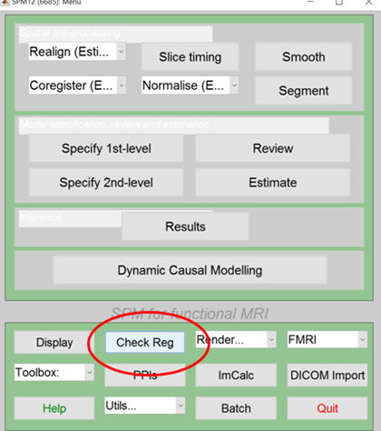
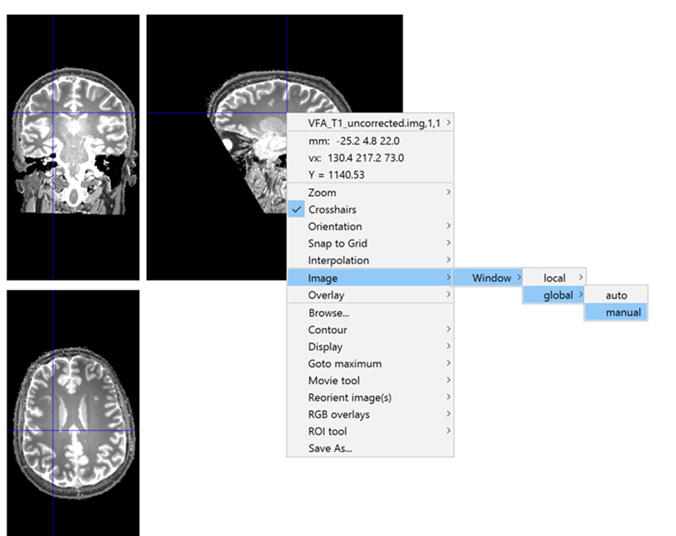

# qMRI-workshop: T1 and PD session

## Setup

### matlab    (Exercises 1 - 5)
Each exercise consists of one script whose file name starts with “Exercise*”. All tasks within each exercise are contained in the script. It is best to open each script in the editor and then go through them step by step. You can also try to change them to look at other aspects of the signal equations or data fits.
Use it with a matlab instance and SPM started, make sure to add the path of the project to make functions available. Download and to copy the data folder (see below) to the `matlab/` folder in the same directory and `cd` there inside *matlab*.

*Software Requirements:* 
- [Matlab](http://www.mathworks.com/products/matlab/)
- [SPM](https://www.fil.ion.ucl.ac.uk/spm/software/download/)

Additionally, you need to get the following dependencies and add them to your matlab path (best clone them all within one directory and add the directory as seen in the matlab exercise scripts):
- Exercise 4: [Mezerlab - M0_to_PD](https://github.com/MezerLab/M0_to_PD) + [Vistasoft](https://github.com/vistalab/vistasoft)
- Exercise 5: [Mezerlab - MDM](https://github.com/MezerLab/MDM_toolbox) + [boundedline - pkg](https://github.com/kakearney/boundedline-pkg)

### python    (Exercises 1 - 3)
There is jupyter notebooks provided for Exercises *1-3* under `python/`.
To:
- Use directly - best open a new tab:  - Navigate to `python/` and run through the notebooks
- Use from [Google Colab](https://colab.research.google.com). $\leftarrow$ **Click Link - switch to Github tab on landing page - Search this very github**:`https://github.com/schmidtijoe/qMRI-workshop` and the notebooks should be available to be hosted in Colab. You can execute all cells there and run through in your browser.
- Run from your own favorite distribution: (check requirements.txt)

## Data
- For Exercises 1-3 you can find the example data here: [example 3 - data](https://owncloud.gwdg.de/index.php/s/HoY0Kl4aNetZbJA)
- Exercises 4-5 can be done with example data provided in the respective github repositories (M0_to_PD, MDM_toolbox). See documentation in the matlab scripts.

## Material / Exercises
also to be found in the `exercises.pdf`

The exercises entail questions that should help you understand and explore the simulations and data.
Some Exercises also have suggestions and further questions in case you are making faster progress or would like to look at them outside the course.
Exercises 1 and 2 are based on synthetic data. On 3-5 in vivo data is explored.

### 1) **I**nversion **R**ecovery - Signal and Fit

This exercise explores the signal evolution in a simulated IR experiment.
Main Script: Exercise1_IR.m / notebook 1
- plot signal for 3 different T1 as found in gray, white matter and CSF what flip angle would offer the highest contrast and contrast-to-noise ratio?

- plot signal of IR sequence depending on a short or long TR
  - what happens at TR = 5*T1, what with TR = T1?
  - Why are the experiments usually performed with long TR?
  
- estimate T1 from fitting IR signal from exercise above with TR = 5*T1 and TR = T1
  - why are the T1 estimates biased? what can we do about it?

-	plot signal of IR sequence depending on inversion efficiency cos(rho*alpha) with rho <= 1.0
  - how does the curve differ from the optimal case with perfect inversion?

- estimate T1 from fitting the IR signal from the exercise above with cos(rho*alpha) with rho=0.8, assuming a perfect inversion.
  - why are the T1 estimates biased? what can we do about it?
  - estimate T1 from fitting IR signal from exercise above with cos(rho*alpha) with rho=0.8

Add-ons/practice at home:
- what happens when you add noise to data? Tip: you can use the randn function for adding normally distributed noise.
  - spoiler alert: already done in the python scripts, you can try changing the SNR parameter
  
### 2) FLASH with Variable Flip Angle (VFA) - Signal and Fit

This exercise explores the signal evolution in a simulated VFA FLASH experiment.
Main Script: Exercise2_VFA.m / notebook 2

- plot signal of FLASH sequence depending on T1, flip angle, TR
  - what is the Ernst angle and how is it related to T1 and TR? Read it off the figure and compare it with the theoretical prediction: alpha_Ernst = acos(exp(-TR/T1))
  - how is the contrast/signal difference between different T1 values maximized? I.e., at what flip angle is T1-weighting achieved?
  - what happens at short TR and small flip angles? I.e., would this offer proton-density weighting?

- estimate T1 from fitting the VFA FLASH signal with multiple different flip angles
  - why is the T1 estimate sensitive to B1+ inhomogeneities?
  - How many flip angles do we need for the fit?

Add-ons/practice at home:
- what happens when you add noise to the data? You can use the randn function for adding normally distributed noise.
- what happens if you choose too low or too high a flip angle; e.g., all higher than the Ernst angle?

### 3) Dual Flip Angle (DFA) T1 Mapping of In-Vivo FLASH Acquisition

This Exercise estimates T1 from a dual flip angle FLASH dataset acquired on a healthy volunteer. 
Main Script: Exercise3_DFA_map.m / notebook 3
 
- Estimate T1 from an in-vivo dataset with TR = 25ms and two nominal flip angles alpha1 = 60 and alpha 2= 210.
  - remember its using the data found (see above under 'Data') [here](https://owncloud.gwdg.de/index.php/s/HoY0Kl4aNetZbJA) 
  - Data were acquired at 3T resulting in significant B1+ inhomogeneities and local deviations from the nominal flip angles alpha1 and alpha2. Thus, a B1+ map (“B1map.nii”) was also acquired, which provides the percent ratio between actual over nominal flip angle (i.e., at 100% the nominal and actual flip angle are identical).
- Perform two fits. One without accounting for the local B1+ field, yielding the apparent uncorrected T1. The other fit includes the B1+ map and adjusts for the B1+ inhomogeneities. Note that the fitting procedure will take 3-5 mins depending on the computer’s performance.
  - the script outputs in parallel: "VFA_T1_uncorrected.img" and "VFA_T1_B1_corrected.img" for the apparent T1 and B1+ corrected T1 map
  - how can the B1+ inhomogeneities be seen in the apparent T1 map? Look at symmetry and deviations of T1 within a tissue type.
  - what are the effects of the correction? how large are they?
  - do they scale linearly with the B1+ inhomogeneities? Compare with the B1 map "B1map.nii".
-	You can easily compare the images using SPM12 and the "Check Reg" button on the start window
  - start SPM by typing "SPM fMRI"
  - Use the "Check Reg" button and select the images with the file selector box (see below)
  - Set the windowing to [0 2000] for best visualization of T1 maps - by right clicking on the displayed image and selecting the context menu "Image->global->manual". If you use local, then only the current display is re-windowed. See Fig. below.
  
 check reg spm            |  check reg window
:-------------------------:|:-------------------------:
  |   
  
Add-ons/practice at home:
- Compare the weighted images “PDw.nii”, “T1w.nii” with the quantitative maps.
- How is the contrast and signal affected in the weighted images compared to the quantitative maps? 
- Why does the signal increase towards the cortex – as most easily seen in the PD-weighted image?

### 4)  VFA PD map fit using T1 map regularization of In-Vivo FLASH Acquisition
This Exercise estimates PD from DFA data (like we handled in the previous exercises). Additional data includes a brain mask and a segmentation.
Main Script: Exercise4.m

- Load and visualize data
    - Compare with previous T1 and M0 image. Note additional brain mask and segmentation.
    - Do you notice the coil gain bias in the M0 image?
-	Run the PD – analysis script to try to eliminate the bias
    - Compare output PD to input M0 image
    - Take a look at the coil gain estimate
- Find the WF and MTV from the estimated PD
    - Check typical GM and WM values

Add-ons/practice at home:
- Try using SPM to get Brain Mask and segmentation like the one provided for the previously used high res data from exercise 3 and run above script.

### 5) Relaxivity fit using R1 and MTV maps
This Exercise estimates PD from DFA data (like we handled in the previous exercises). Additional data includes a brain mask and a segmentation.
Main Script: Exercise5.m

- Load and visualize data
  - R1, MTW and segmentation like in previous exercise – What does the R1 contrast show?
  - There are 5 ROIs on one hemisphere. Can you tell what are the ROIs?
-	Calculate linear dependency of R1 and MTV
  - Run the MDM script
  - look at the figures and rank the 5 ROIs according to their R1, MTV & relaxivity.

